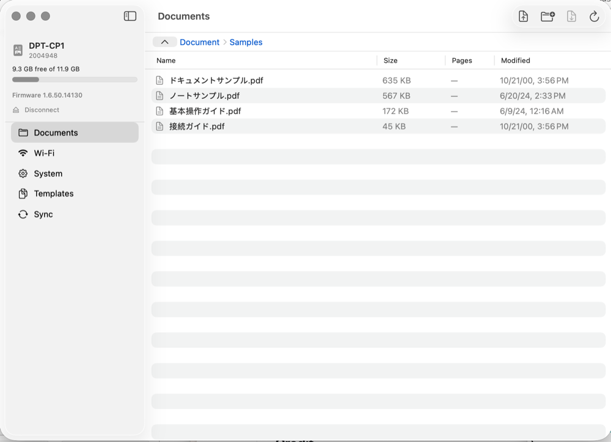

# Digital Paper for macOS

A native macOS app for managing Sony Digital Paper devices (DPT-RP1, DPT-CP1)
and the Fujitsu Quaderno — a graphical replacement for Sony's discontinued
Digital Paper App and the [`dpt-rp1-py`](https://github.com/janten/dpt-rp1-py)
command-line tool.

The device protocol is reimplemented natively in Swift (no Python dependency):
mDNS discovery, the Diffie-Hellman pairing handshake, RSA-SHA256 session auth,
and the full document/Wi-Fi/system/template REST API.

<p align="center">
  
</p>

## Features

- **Guided pairing** — discover devices on the network, pair with the on-device
  PIN, or import credentials already created by `dpt-rp1-py` / Sony's app.
- **Document browser** — folders, drag-and-drop upload, download, delete,
  rename, move, and "open on device".
- **Device status** — battery, storage, firmware in the sidebar.
- **Wi-Fi** — enable/disable, list/scan/add/remove networks.
- **System** — owner, time zone, and screenshot capture.
- **Templates** — list, upload, delete note templates.
- **Sync** — two-way folder sync (newest wins) with a change preview.

## Architecture

| Module | Responsibility |
|---|---|
| `DigitalPaperKit` | Protocol + crypto + networking (no UI). `DigitalPaperClient` actor, `Registration`, `DeviceDiscovery`, `CredentialStore`, and the `Crypto/` port. |
| `DigitalPaper` | SwiftUI app: `AppModel` + feature view models and views. |
| `DigitalPaperKitTests` | Validates the crypto port byte-for-byte against `dpt-rp1-py` reference vectors. |

Credentials are stored in the Keychain, keyed by device serial.

## Download the Prebuilt App

A prebuilt macOS Universal app is available from the upstream v0.1.0 release:

[Download DigitalPaper-macOS.zip](https://github.com/plateaukao/sony-dpt-rp1-mac-app/releases/download/v0.1.0/DigitalPaper-macOS.zip)

1. Download and unzip `DigitalPaper-macOS.zip`.
2. Move `DigitalPaper.app` to `/Applications`.
3. On the first launch, right-click the app and choose **Open** if macOS shows a Gatekeeper warning.

The upstream release requires macOS 14 or later and is not notarized. If the
downloaded app fails to launch because of an embedded framework signature
problem, repair it with:

```bash
scripts/release.sh /path/to/DigitalPaper.app
```

See [`docs/APP_REPAIR.md`](docs/APP_REPAIR.md) for details.

## 下载预编译 App

可以直接下载上游 v0.1.0 的 macOS Universal 预编译版本：

[下载 DigitalPaper-macOS.zip](https://github.com/plateaukao/sony-dpt-rp1-mac-app/releases/download/v0.1.0/DigitalPaper-macOS.zip)

安装步骤：

1. 下载并解压 `DigitalPaper-macOS.zip`；
2. 将 `DigitalPaper.app` 拖入 `/Applications`；
3. 第一次启动时，如果 macOS 显示 Gatekeeper 安全提示，请右键点击 App 并选择“打开”。

该上游版本要求 macOS 14 或更高版本，且尚未完成公证。如果下载的 App 因内嵌 Framework 签名问题无法启动，可以运行：

```bash
scripts/release.sh /path/to/DigitalPaper.app
```

详细说明请参阅 [`docs/APP_REPAIR.md`](docs/APP_REPAIR.md)。

## Build & Run

Requires Xcode 16+ and [XcodeGen](https://github.com/yonyz/XcodeGen)
(`brew install xcodegen`).

```bash
xcodegen generate
open DigitalPaper.xcodeproj      # or build from the CLI:
xcodebuild -project DigitalPaper.xcodeproj -scheme DigitalPaper \
  -destination 'platform=macOS' build
```

## Test

```bash
xcodebuild -project DigitalPaper.xcodeproj -scheme DigitalPaper \
  -destination 'platform=macOS' test -only-testing:DigitalPaperKitTests
```

Reference crypto vectors are regenerated with `python3 tools/gen_vectors.py`
(requires the `cryptography` package).

## Repair an Existing App

`scripts/release.sh` repairs and packages an existing `DigitalPaper.app`
without compiling the project or requiring Xcode. It signs embedded frameworks
first, signs the outer app second, verifies the bundle, creates a repaired ZIP,
and opens the app by default.

```bash
scripts/release.sh /path/to/DigitalPaper.app
```

See [`docs/APP_REPAIR.md`](docs/APP_REPAIR.md) for Chinese and English
documentation, signing modes, options, and distribution notes.

## Credit

Protocol reverse-engineering is based on the excellent
[`dpt-rp1-py`](https://github.com/janten/dpt-rp1-py) project.
